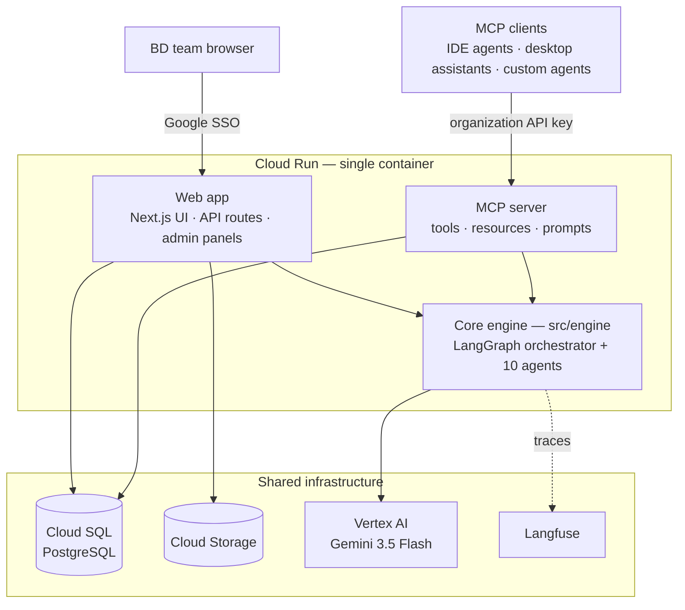
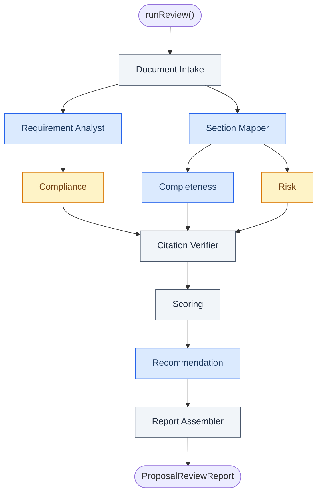
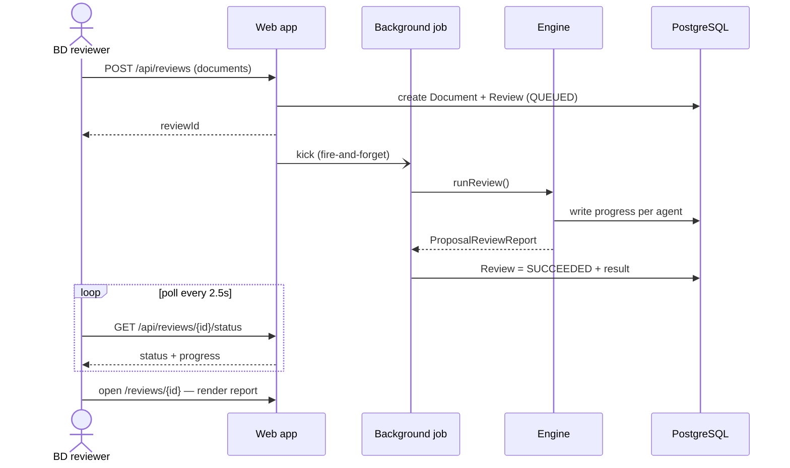
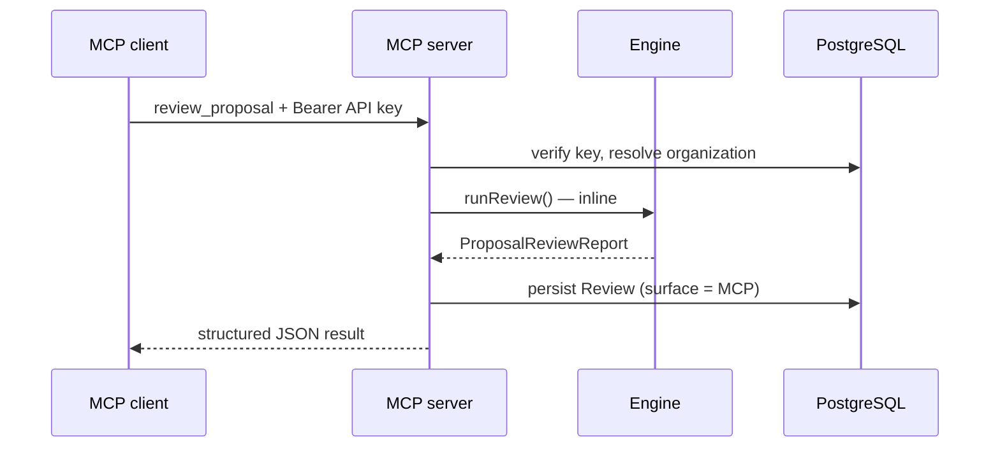
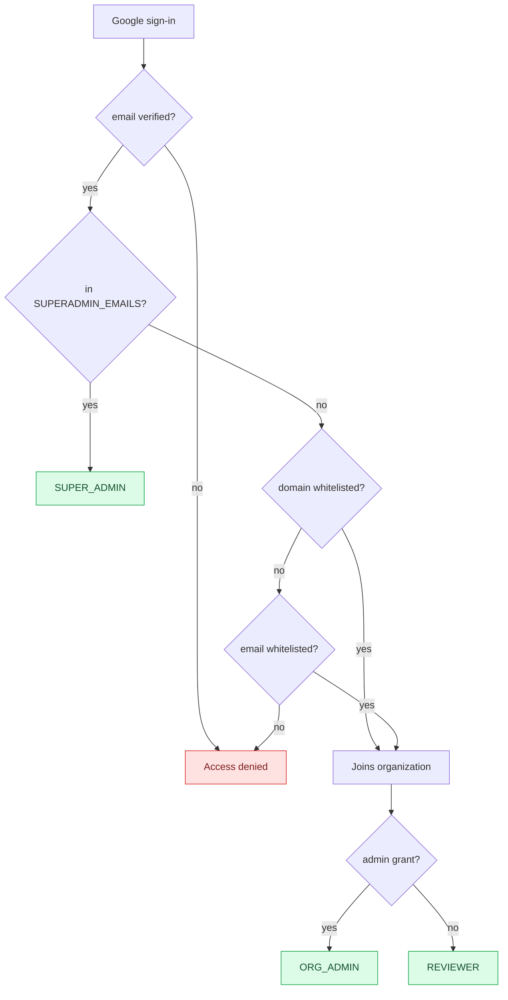
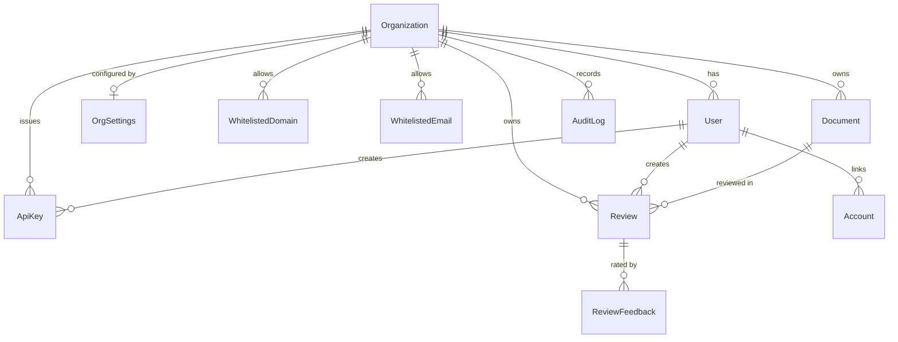
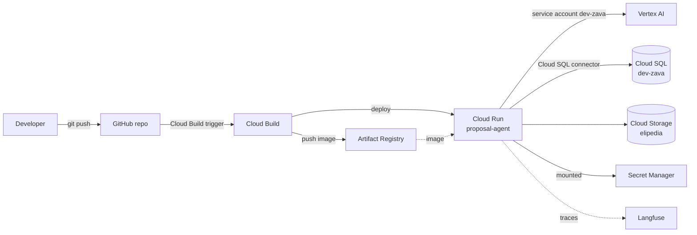

# Architecture

The AI Proposal Checking Agent reviews a Business Development proposal draft against a
client brief / RFP / TOR and returns a structured, citation-grounded checking result. It is
built as **one framework-agnostic engine consumed by two delivery surfaces** — an MCP
server and a multi-tenant SaaS web app.

> All diagrams below are [Mermaid](https://mermaid.js.org/) and render directly on GitHub.

## System architecture



The **engine** has no HTTP or framework dependencies. The web app and the MCP server are
peer consumers of it — the same review capability is reachable from a browser or from any
AI agent. Everything ships in one container and runs as a single Cloud Run service.

## Components

| Component | Path | Responsibility |
|---|---|---|
| Engine | `src/engine/` | The multi-agent orchestrator + agents |
| MCP server | `src/mcp/` + `src/app/api/mcp/` | Exposes the engine as MCP tools/resources/prompts |
| Web app | `src/app/` | Next.js UI, API routes, admin & platform panels |
| Services | `src/lib/` | Auth, tenancy, storage, the review runner, document parsing |
| Data | `prisma/` | Schema, migrations, seed |

## The multi-agent pipeline



A LangGraph `StateGraph` orchestrates ten agents. **Completeness, Compliance and Risk run
concurrently** (fan-out); the Citation Verifier joins them. Blue nodes are LLM agents, grey
nodes are deterministic, amber nodes are tool-using agents (they call the `search_proposal`
retrieval tool). Two deterministic agents make the result trustworthy: the **Citation
Verifier** downgrades any claim it cannot ground in the source, and the **Scoring** agent
hard-caps the verdict at `NOT_READY` when a mandatory section is missing. See
[engine.md](engine.md) for the full agent reference.

## Request flows

### Web review — asynchronous



The upload returns immediately; the engine runs as a background job and streams per-agent
progress into the database, which the review page polls.

### MCP review — synchronous



Over MCP the engine runs inline — the tool call stays open until the report is ready.

## Multi-tenancy & access control



Every business record carries an `organizationId`. Web sign-in is gated in the Auth.js
callbacks by this flow; the MCP surface authenticates with per-organization API keys
instead. Both paths resolve to exactly one organization, and all data access is scoped to
it.

## Data model



PostgreSQL via Prisma (`prisma/schema.prisma`). `Review` holds the run status, per-agent
progress and the full structured `result` JSON. `OrgSettings` holds the per-organization
model config and review rubric. `Account` stores the Google OAuth tokens used to export
Google Docs. (`Session` / `VerificationToken` are Auth.js plumbing, omitted above.)

## Deployment topology



A push to `main` triggers Cloud Build, which builds the image, pushes it to Artifact
Registry and deploys a new Cloud Run revision. The service runs as the `dev-zava` service
account; secrets are mounted from Secret Manager. See [deployment.md](deployment.md).

## Technology stack

TypeScript · Next.js 15 (App Router) · LangGraph.js · Vertex AI Gemini 3.5 Flash ·
`@modelcontextprotocol/sdk` + `mcp-handler` · Auth.js v5 · Prisma + PostgreSQL ·
Langfuse · Zod · Tailwind CSS + shadcn/ui · Docker → Cloud Run.

## Repository layout

```
src/engine/      orchestrator · agents/* (10) · schema (Zod) · tools · llm · langfuse
src/mcp/         server (tools/resources/prompts) · stdio entry · context (API-key auth)
src/app/         routes — (app)/* UI, admin/*, platform/*, api/* (reviews, auth, mcp)
src/lib/         auth, session, tenancy, storage, reviews runner, engine-config, docparse/*
src/components/  app shell, review UI, admin UI, ui/* primitives
prisma/          schema · migrations · seed
scripts/         review-sample · eval · deploy
samples/ · eval/ · doc/
```
